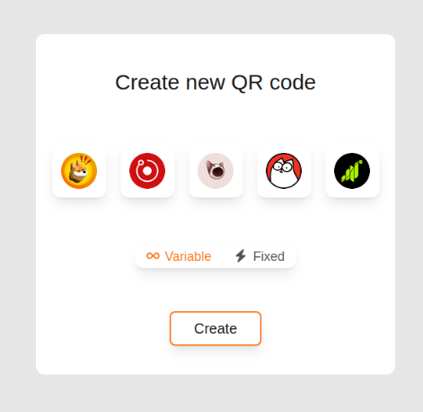
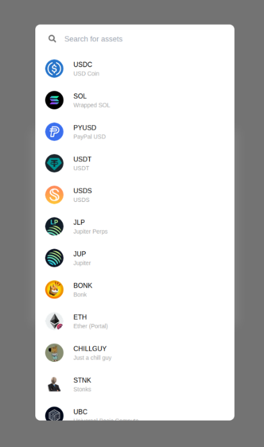
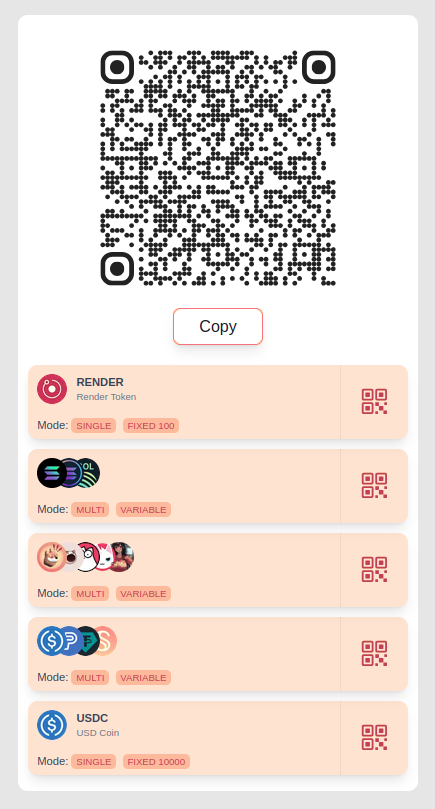
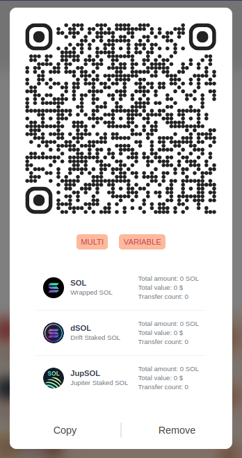
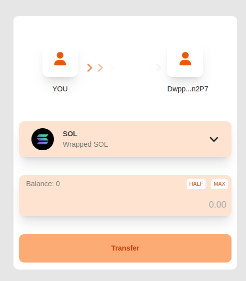

# Hemmorphi: QR Code Crypto Transfers on Solana

This project is a comprehensive system for transferring cryptocurrencies on the Solana blockchain using QR codes. The primary goal is to streamline the process of making crypto transfers, enhancing security, and providing users with greater control over their funds.

The system is built with a modern tech stack, featuring a Next.js web application for the user interface and API, and an Anchor-based smart contract for the on-chain logic. This application serves as a powerful alternative to traditional cryptocurrency transfer methods, with potential for expansion to other blockchain networks or further development towards decentralized payment systems.

## ✨ Key Features

- **Simplified Transfers**: Send and receive SPL tokens easily by scanning QR codes.
- **Custom QR Code Generation**: Create personalized QR codes for specific tokens and amounts.
- **Transaction Security**: Each QR code is linked to a unique account, preventing address reuse and enhancing security.
- **Detailed Statistics**: Track the usage and transaction history for each generated QR code.
- **Wallet Integration**: Connects seamlessly with Solana wallets like Phantom.
- **Token Management**: View your token balances and select which token to use for transfers.

## 📸 Screenshots

Here are some glimpses of the application's user interface:

#### QR Code Creation

_Users can generate a new QR code for receiving payments with a selected token._

<p align="center">
  
</p>

---

#### Available Tokens

_A clear list of available tokens that can be selected for a transaction._

<p align="center">
  
</p>

---

#### QR Codes List

_Manage and view all your generated QR codes in one place._

<p align="center">
  
</p>

---

#### QR Code Details & Stats

_Get detailed statistics for each QR code, including scan counts and total received value._

<p align="center">
  
</p>

---

#### Transfer Screen

_An intuitive interface for executing the token transfer after scanning a QR code._

<p align="center">
  
</p>

## 🛠️ Technology Stack

The project is divided into two main parts: the on-chain program (smart contract) and the off-chain client (web application).

- **Blockchain & Smart Contract:**

  - **Solana:** A high-performance, low-cost blockchain.
  - **Anchor:** A framework for building and testing Solana smart contracts.
  - **Rust:** The language used for the smart contract logic.

- **Frontend & API:**
  - **Next.js:** A React framework for building server-rendered applications.
  - **TypeScript:** For type-safe JavaScript development.
  - **React Query:** For managing server state and caching data.
  - **Tailwind CSS:** A utility-first CSS framework for rapid UI development.
  - **web3.js/solana:** For interacting with the Solana blockchain from the client.

## 📂 Project Structure

The repository is organized as follows:

```
.
├── contract/         # Anchor smart contract source code
│   ├── programs/     # The on-chain program (Rust)
│   ├── tests/        # Integration tests for the contract
│   └── migrations/   # Deployment scripts
├── src/              # Next.js application source code
│   ├── app/          # Main application pages and API routes
│   ├── components/   # Reusable React components
│   ├── hooks/        # Custom React hooks
│   ├── lib/          # Core libraries and constants
│   └── utils/        # Utility functions for Solana interactions
├── public/           # Static assets
└── docs/             # Project documentation and screenshots
```

## 🚀 Getting Started

To run this project locally, you will need Node.js, Bun, and the Rust toolchain with Anchor installed.

1.  **Clone the repository:**

    ```bash
    git clone https://github.com/tejks/hemmorphi.git
    cd hemmorphi
    ```

2.  **Install web application dependencies:**

    ```bash
    bun install
    ```

3.  **Build and deploy the smart contract (requires Solana CLI and Anchor):**

    ```bash
    cd contract
    anchor build
    anchor deploy
    ```

4.  **Run the web application:**
    ```bash
    cd ..
    bun dev
    ```

Open [http://localhost:3000](http://localhost:3000) in your browser to see the application.
